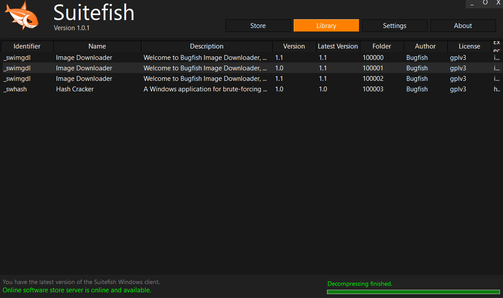

# Suitefish - Windows Software

> [!NOTE]
> No new features are planned for this project at this time.

> [!TIP]
> This project is actively maintained, with regular updates and prompt fixes for reported issues.

## 🔍 Introduction

The Suitefish CMS Windows Client allows you to easily download and access software from the Suitefish store for various purposes. Once downloaded, the client connects seamlessly with your Suitefish CMS instance, providing a user-friendly interface to manage your content.

## 🖱️ Installation

1. **Download the Portable Version**: Copy the preferred version installer from `_releases/_executable/VERSION.zip` to your computer.
2. **Copy Files**: Copy the extracted files from `VERSION.zip` to your desired location.
3. **Launch the Application**: Run `suitefish.exe` from the installation directory.

## 🏳️‍🌈 Multi-Language Support

This project supports multiple languages, including German, English, Spanish, Italian, French, Japanese, Chinese, Russian, Hindi, Portuguese, Korean, and Turkish.

## 📖 Documentation

The following documentation is intended for both end-users and developers.

| **Description**                                                       | **Link**                                                                                         |
|----------------------------------------------------------------------|-------------------------------------------------------------------------------------------------|
| A playlist or video related to this project. | [https://www.youtube.com/playlist?list=PL6npOHuBGrpAfrpUzQPTOWdqoCnhq1oP0](https://www.youtube.com/playlist?list=PL6npOHuBGrpAfrpUzQPTOWdqoCnhq1oP0)|
| If this repository contains a _videos folder, you can check that as well. | |

Interesting websites.

| Description | Link  |
|----------------|----------------------------|
| Bugfish Website | [https://bugfish.eu](https://bugfish.eu)|
| Suitefish-CMS Store / Website | [https://suitefish.com](https://suitefish.com)|

The following documentation is intended for developers.

| Description | Link  |
|----------------|----------------------------|
| CMS Developer Documentation                                                                                              | [https://bugfishtm.github.io/suitefish-cms/](https://bugfishtm.github.io/suitefish-cms/)|
| Framework Developer Documentation                                                                                        | [https://bugfishtm.github.io/bugfish-framework/](https://bugfishtm.github.io/bugfish-framework/)  |
| AdminBSB Theme Developer Documentation                                                                                        | [https://bugfishtm.github.io/suitefish-cms/extra-adminbsb/](https://bugfishtm.github.io/suitefish-cms/extra-adminbsb/)  |

Relevant GitHub Repositories.

| Description | Link  |
|----------------|----------------------------|
| Suitefish-CMS | [https://github.com/bugfishtm/suitefish-cms](https://github.com/bugfishtm/suitefish-cms)|
| Suitefish Official Module Library | [https://github.com/bugfishtm/suitefish-modules](https://github.com/bugfishtm/suitefish-modules)|
| Suitefish Windows Software | [https://github.com/bugfishtm/suitefish-windows](https://github.com/bugfishtm/suitefish-windows)|
| Bugfish Framework | [https://github.com/bugfishtm/bugfish-framework](https://github.com/bugfishtm/bugfish-framework)|

The following sites may be interestinig for docker instance developers and users.

| Description | Link  |
|----------------|----------------------------|
| Docker Base Image | [https://hub.docker.com/r/bugfishtm/sf-base](https://hub.docker.com/r/bugfishtm/sf-base)|
| Docker Suitefish Image  | [https://hub.docker.com/r/bugfishtm/suitefish](https://hub.docker.com/r/bugfishtm/suitefish)|

## ❓ Support Channels

If you encounter any issues or have questions while using this software, feel free to contact us:

- **GitHub Issues** is the main platform for reporting bugs, asking questions, or submitting feature requests: [https://github.com/bugfishtm/suitefish-cms/issues](https://github.com/bugfishtm/suitefish-cms/issues)
- **Discord Community** is available for live discussions, support, and connecting with other users: [Join us on Discord](https://discord.com/invite/xCj7AEMmye)  
- **Email support** is recommended only for urgent security-related issues: [security@bugfish.eu](mailto:security@bugfish.eu)

## 📢 Spread the Word

Help us grow by sharing this project with others! You can:  

* **Tweet about it** – Share your thoughts on [Twitter/X](https://twitter.com) and link us!  
* **Post on LinkedIn** – Let your professional network know about this project on [LinkedIn](https://www.linkedin.com).  
* **Share on Reddit** – Talk about it in relevant subreddits like [r/programming](https://www.reddit.com/r/programming/) or [r/opensource](https://www.reddit.com/r/opensource/).  
* **Tell Your Community** – Spread the word in Discord servers, Slack groups, and forums.  

## 📁 Repository Structure 

This table provides an overview of key files and folders related to the repository. Click on the links to access each file for more detailed information. If certain folders are missing from the repository, they are irrelevant to this project.

| Document Type | Description |
|----|-----|
| .github | Folder containing GitHub configuration and workflow files. |
| [.github/CODE_OF_CONDUCT.md](./.github/CODE_OF_CONDUCT.md) | Community guidelines for participation. |
| _changelogs | Folder containing changelogs for version tracking. |
| _images | Folder containing project images and graphics. |
| _licenses | Folder with third-party license information. |
| _releases | Folder containing release versions of the project. |
| _screenshots | Folder with screenshots of the project. |
| _source | Folder containing the main source code. |
| docs | Folder for documentation and guides. |
| .gitattributes | Git configuration file for repository attributes (dev use). |
| .gitignore | Git configuration file for ignored files/folders (dev use). |
| README.md | Main readme file for project overview and instructions. |
| repository_reset.bat | Batch script to reset the repository (dev use). |
| repository_update.bat | Batch script to update the repository (dev use). |
| [CONTRIBUTING.md](CONTRIBUTING.md) | Guidelines and instructions for contributors. |
| [CHANGELOG.md](CHANGELOG.md) | Main changelog file summarizing project changes. |
| [SECURITY.md](SECURITY.md) | Security policy and reporting instructions. |
| [LICENSE.md](LICENSE.md) | Project license and usage terms. |
| [README.md](README.md) | Main readme file (you are currently viewing this). |

## 📑 Changelog Information

Refer to the _changelogs folder for detailed, HTML-formatted records of updates and changes. GitHub Releases also include these changelogs. If the _changelogs folder is missing, changelogs are not being tracked.

## 🌱 Contributing to the Project

I am excited that you're considering contributing to our project! Here are some guidelines to help you get started.

**How to Contribute**

1. Fork the repository to create your own copy.
2. Create a new branch for your work (e.g., `feature/my-feature`).
3. Make your changes and ensure they work as expected.
4. Run tests to confirm everything is functioning correctly.
5. Commit your changes with a clear, concise message.
6. Push your branch to your forked repository.
7. Submit a pull request with a detailed description of your changes.
8. Reference any related issues or discussions in your pull request.

**Coding Style**

- Keep your code clean and well-organized.
- Add comments to explain complex logic or functions.
- Use meaningful and consistent variable and function names.
- Break down code into smaller, reusable functions and components.
- Follow proper indentation and formatting practices.
- Avoid code duplication by reusing existing functions or modules.
- Ensure your code is easily readable and maintainable by others.

## 🤝 Community Guidelines

We’re on a mission to create groundbreaking solutions, pushing the boundaries of technology. By being here, you’re an integral part of that journey. 

**Positive Guidelines:**
- Be kind, empathetic, and respectful in all interactions.
- Engage thoughtfully, offering constructive, solution-oriented feedback.
- Foster an environment of collaboration, support, and mutual respect.

**Unacceptable Behavior:**
- Harassment, hate speech, or offensive language.
- Personal attacks, discrimination, or any form of bullying.
- Sharing private or sensitive information without explicit consent.

Let’s collaborate, inspire one another, and build something extraordinary together!

## 🛡️ Warranty and Security

I take security seriously and appreciate responsible disclosure. If you discover a vulnerability, please follow these steps:

- **Do not** report it via public GitHub issues or discussions. Instead, please contact the [security@bugfish.eu](mailto:security@bugfish.eu) email address directly.   
- Provide as much detail as possible, including a description of the issue, steps to reproduce it, and its potential impact.  

I aim to acknowledge reports within **2–4 weeks** and will update you on our progress once the issue is verified and addressed.

This software is provided as-is, without any guarantees of security, reliability, or fitness for any particular purpose. We do not take responsibility for any damage, data loss, security breaches, or other issues that may arise from using this software. By using this software, you agree that We are not liable for any direct, indirect, incidental, or consequential damages. Use it at your own risk.

## 🦈 Powered by Suitefish

This project has been created with [Suitefish-CMS](https://github.com/bugfishtm/suitefish-cms). The Backend consists of a various set of Suitefish functionalities and the full included [Bugfish-Framework](https://github.com/bugfishtm/bugfish-framework).

## 📜 License Information

The license for this software can be found in the [LICENSE.md](LICENSE.md) file. Third-party licenses are located in the ./_licenses folder. The software may also include additional licensed software or libraries.

🐟 Bugfish 
